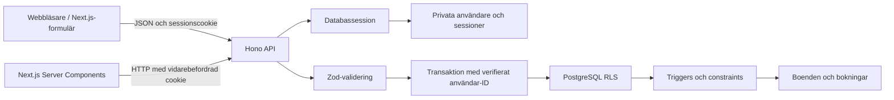

# Arkitektur och regler

## Autentisering och behörighet

Autentisering svarar på vem användaren är. En slumpmässig sessionsnyckel i cookien slås upp via sin hash i `private.sessions`. Sessionens giltighet kontrolleras på varje anrop. Utloggning tar bort sessionen ur databasen; samma cookie fungerar därefter inte.

Auktorisering svarar på vad användaren får göra. API:t kräver inloggning för skrivning och för läsning av bokningar. Varje databasanrop sker i en transaktion där `set_config('app.user_id', verifieratId, true)` sätter identiteten lokalt. Den försvinner vid commit/rollback och kan inte läcka till nästa användare i anslutningspoolen.

RLS skyddar tabellerna även om API:t glömmer ett ägarskapsfilter i sin SQL. Den här PostgreSQL-lösningen förutsätter att bara det betrodda API:t har databaslösenordet och sätter identiteten. Databasen exponeras inte som en direkt SQL-tjänst för gäster; en person med API-rollens databaslösenord skulle annars kunna sätta ett annat användar-ID. Rollen har därför aldrig något frontend-exponerat lösenord. Vid användning av Supabase Auth kan identiteten komma från en verifierad JWT. Den här appen använder Supabase som PostgreSQL-databas och behåller sin egen verifierade sessionshantering.

`private.users` och `private.sessions` har inga rättigheter för boende-/bokningsrollen. Auth-rollen kan hantera konton och sessioner, men inte boenden/bokningar. Båda saknar superuser och RLS-bypass. Setup körs som administratör; API:ts vanliga routes använder aldrig den anslutningen.

## Varför reglerna ligger i databasen

Zod skyddar API-gränsen och ger begripliga fältfel. Databasen kontrollerar det som måste vara sant även vid SQL-anrop: kapacitet, datumordning, e-post, status, identitet och överlappning.

GiST-regeln för dubbelbokning kontrollerar hela tabellen, även bokningar som RLS döljer. En enkel kontroll följd av INSERT hade haft en lucka: två samtidiga anrop kan båda se lediga datum. Exclusion constraint gör att endast en kan lyckas. Constrainten gäller också UPDATE och räknar inte raden som en konflikt med sig själv.

Datumintervallet är `[check_in, check_out)`. Gästen som checkar ut den 13:e hindrar därför inte en ny gäst som checkar in den 13:e. Avbokade rader undantas från constrainten.

## Privilegierade hjälpfunktioner

Tre interna funktioner använder `SECURITY DEFINER`, ligger i `private`, har låst `search_path` och saknar EXECUTE-rätt för PUBLIC:

- `is_available` får se alla bokningar, men lämnar bara tillbaka en boolean. Den kan inte läcka namn, e-post eller andra bokningsdetaljer. Endast applikationsrollen får anropa den.
- `guard_property` behöver kontrollera också bokningar som är osynliga för en gäst. Den körs bara som trigger när RLS redan godkänt boendeägaren.
- `guard_booking` behöver låsa boenderaden utan att gästen får rätt att ändra boendet. Den kontrollerar själv det aktuella användar-ID:t, ägarskapet och tillåtna ändringar. Dessutom måste den yttre INSERT/UPDATE/DELETE-operationen godkännas av RLS.

Att ge en gäst UPDATE-rätt till alla boenden bara för att låsa en rad hade brutit ägarskapet. Funktionen gör det begränsade låset och regelkontrollen istället. Direkt exekvering av triggerfunktionerna är inte tillåten.

## Pris och status

Vid INSERT hämtas priset från boendet och multipliceras med antal kalendernätter. Klientens pris ignoreras. Vid UPDATE behålls priset om datumen är oförändrade; annars används det ursprungliga nattpriset. Ett nytt pris på boendet påverkar nya bokningar.

Status börjar som `pending`. Bara värden kan ändra till `confirmed`; gäst och värd kan ändra till `cancelled`. `confirmed → pending` och ändring av en avbokad bokning nekas. Gästens uppgifter får inte ändras av värden. Påbörjade bokningar kan varken redigeras, avbokas eller tas bort via applikationsrollen.

## HTTP-kontrakt

| Händelse                                             | Status |
| ---------------------------------------------------- | ------ |
| Lyckad läsning/ändring                               | 200    |
| Skapat konto, boende eller bokning                   | 201    |
| Utloggning/borttagning                               | 204    |
| Ogiltig JSON, indata, kapacitet eller statusregel    | 400    |
| Inloggning saknas/felaktiga inloggningsuppgifter     | 401    |
| Otillåten rolländring eller ursprung                 | 403    |
| Saknad eller för användaren osynlig resurs           | 404    |
| Dubbelbokning, upptagen e-post eller beroende resurs | 409    |
| För många inloggningsförsök                          | 429    |

Skrivoperationer med ett främmande Origin nekas. Cookies använder SameSite=Lax, HttpOnly och Secure vid produktion. Frontend skickar `credentials: 'include'`; Next.js serverkomponenter vidarebefordrar sessionscookien explicit. Inga svar med sessioner eller användardata cachelagras.
